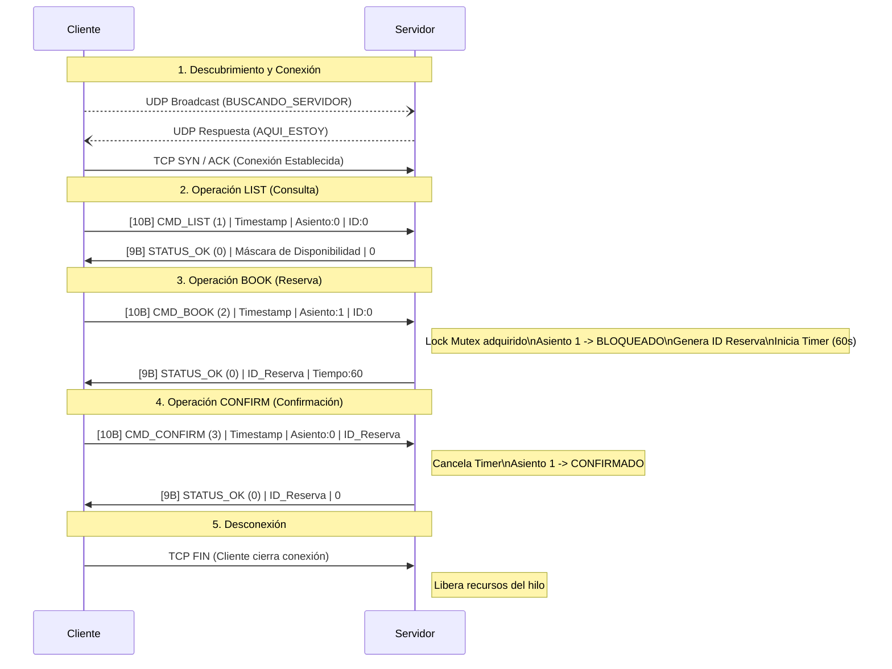
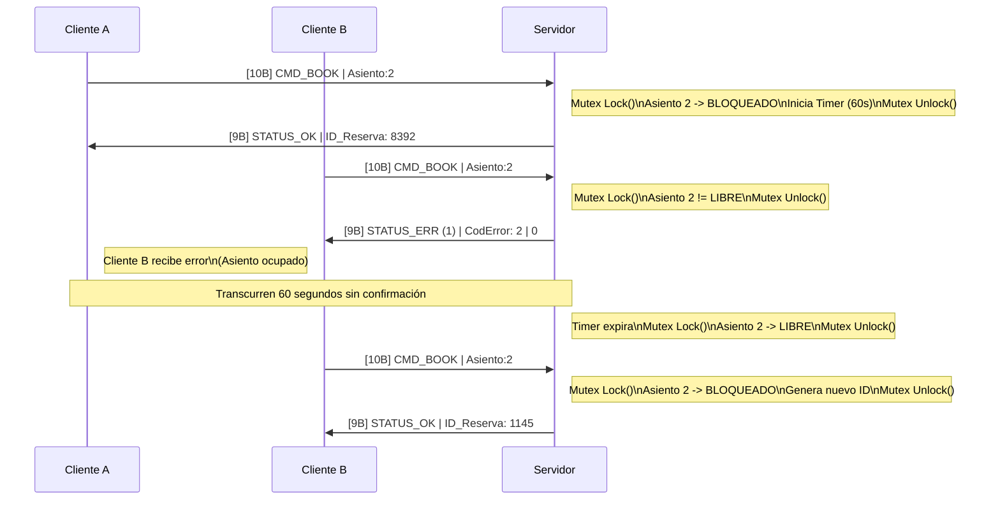

# Práctica: Protocolo de Reservas con Control de Concurrencia (Caso de Uso 5)

**Autores:** 
* Manuel Romero Jiménez
* Francisco Javier Jiménez Villatoro
* Vittorio Maci

---

## 1. Descripción del Protocolo
Este proyecto implementa un sistema de reservas de recursos limitados en red. El protocolo permite a múltiples clientes consultar el inventario disponible y formalizar reservas de manera consistente. El servidor actúa como la única entidad responsable de mantener el estado global de los recursos, garantizando una consistencia fuerte y evitando la asignación duplicada de un mismo recurso bajo condiciones de alta concurrencia.

## 2. Arquitectura
El sistema se basa en una arquitectura **Cliente-Servidor** utilizando el protocolo de transporte **TCP** mediante la API de sockets nativa. 

Para gestionar la concurrencia exigida por el caso de uso, el servidor implementa un modelo multihilo (`threading`), asignando un hilo de ejecución independiente a cada cliente conectado. Para proteger la integridad del inventario de recursos compartidos y evitar condiciones de carrera durante las operaciones de reserva y cancelación, se utiliza un mecanismo de exclusión mutua mediante un cerrojo (`Lock`).

## 3. Especificación Formal (ABNF)
La comunicación entre cliente y servidor se rige estrictamente por la siguiente gramática ABNF:

```abnf
; --- MENSAJES DEL CLIENTE (REQUESTS: 10 Bytes) ---
request = comando timestamp asiento id-reserva

comando    = %x01 / %x02 / %x03 / %x04        ; 1=LIST, 2=BOOK, 3=CONFIRM, 4=CANCEL
timestamp  = 4OCTET                           ; 4 bytes (uint32) Unix Epoch
asiento    = %x00 / %x01 / %x02 / %x03 / %x04 ; 1 byte (0 si no aplica, o 1-4)
id-reserva = 4OCTET                           ; 4 bytes (uint32) ID temporal

; --- MENSAJES DEL SERVIDOR (RESPONSES: 9 Bytes) ---
response = estado dato1 dato2

estado = %x00 / %x01 / %x02                   ; 1 byte: 0=OK, 1=ERR, 2=NONE
dato1  = 4OCTET                               ; 4 bytes (uint32) Payload 1
dato2  = 4OCTET                               ; 4 bytes (uint32) Payload 2

; --- DEFINICIONES AUXILIARES ---
OCTET = %x00-FF                               ; 1 Byte de datos puros (8 bits)
```

## 4. Requisitos e Instrucciones de Ejecución

### Requisitos del sistema
* **Python 3.x** instalado en ambas máquinas (o en la máquina local para pruebas).
* Conectividad de red habilitada entre el equipo que ejecuta el cliente y el servidor.

### Instrucciones de ejecución
El servidor debe iniciarse siempre antes que los clientes para habilitar el puerto de escucha.

1. **Lanzar el servidor:**
   Abra una terminal en el directorio raíz del proyecto y ejecute:
   ```bash
   python server.py
   ```
2. **Lanzar el cliente:**
   Abra una nueva terminal (puede ser en la misma máquina o en otra conectada a la red) y ejecute:
   ```bash
   python client.py
   ```

## 5. Ejemplos de uso

A continuación, se representan los flujos de interacción temporal entre cliente y servidor, ilustrando cómo el protocolo garantiza el control de estado y la concurrencia.

### 5.1. Ciclo de Vida Nominal (Happy Path)

Este diagrama describe el escenario ideal donde un cliente se conecta, consulta la disponibilidad, bloquea un asiento y confirma la reserva antes de que expire el temporizador.



### 5.2 Gestión de Concurrencia y Expiración (Timeout)

Este escenario demuestra la eficacia del sistema cuando dos clientes intentan reservar el mismo recurso, y qué ocurre si un cliente no confirma su reserva en el tiempo establecido.


